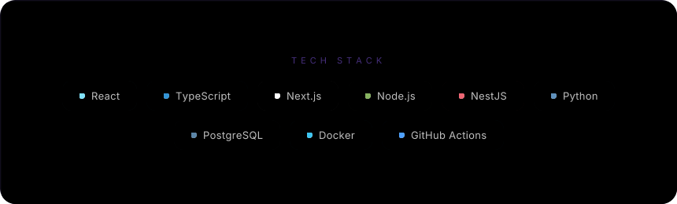
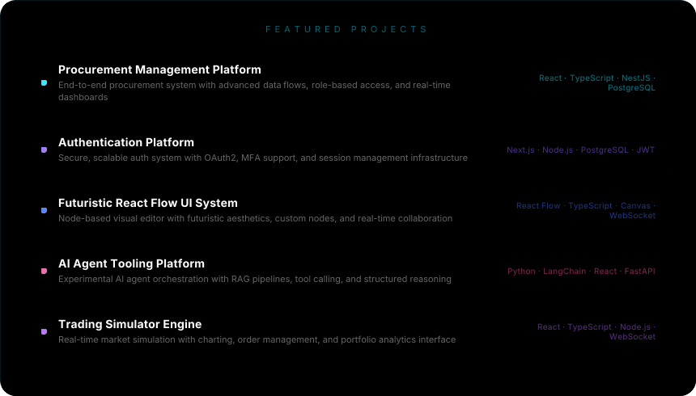
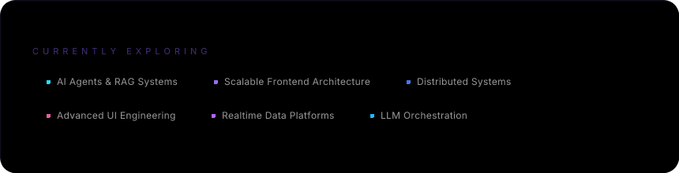

<!-- ═══════════════════════════════════════════════════════════════════ -->

<!-- HERO SECTION — Animated banner with name, subtitle, floating orbs -->

<!-- ═══════════════════════════════════════════════════════════════════ -->

<!-- ═══════════════════════════════════════════════════════════════ -->

<!-- TECH STACK SECTION — Animated glowing technology cards         -->

<!-- ═══════════════════════════════════════════════════════════════ -->

<!-- ═══════════════════════════════════════════════════════════════ -->

<!-- ABOUT ME SECTION — Terminal-style glassmorphism panel          -->

<!-- ═══════════════════════════════════════════════════════════════ -->

<!-- ═══════════════════════════════════════════════════════════════════ -->

<!-- FEATURED PROJECTS — Rich project cards with animated glow borders -->

<!-- ═══════════════════════════════════════════════════════════════════ -->

<!-- ═══════════════════════════════════════════════════════════════ -->

<!-- GITHUB STATS — Cohesive themed statistics                      -->

<!-- ═══════════════════════════════════════════════════════════════ -->

<!-- ═══════════════════════════════════════════════════════════════ -->

<!-- CURRENT FOCUS — What I'm building and exploring                -->

<!-- ═══════════════════════════════════════════════════════════════ -->

<!-- ═══════════════════════════════════════════════════════════════ -->

<!-- SOCIAL LINKS — Custom SocialMediaButton components             -->

<!-- ═══════════════════════════════════════════════════════════════ -->

<!-- ═══════════════════════════════════════════════════════════════════ -->

<!-- FOOTER — Animated scanline + terminal aesthetic                    -->

<!-- ═══════════════════════════════════════════════════════════════════ -->

